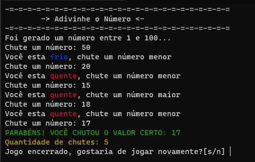

<div align="center">

</div>
<div align="center">
  
<p> </p>

</div>


##  - Objetivo 🛠️
Este projeto é um minijogo criado para testar suas habilidades de adivinhação! você precisa responder o número certo gerado pelo robô



##  - Tecnologias 🚀️
Neste projeto eu usei **random** um módulo python que faz números aleatórios.


##  - Como configurar 🧑‍💻
Primeiro clone este projeto usando:
```
git clone https://github.com/LuanCarvalho0/adivinhador-de-numeros
```
Depois disso é só executar o arquivo python e tudo deve estar funcionando! 👌